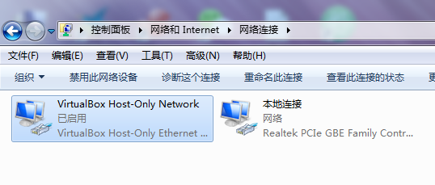
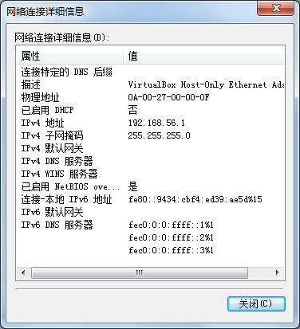
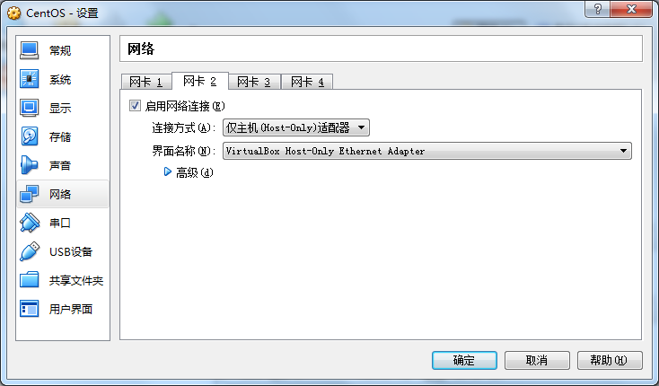

# Linux及常用工具配置 #

- - -
**身为码农，表示十分痛恨服务器上的各种乱七八糟配置，平时很少用到Linux命令，对Linux一直保持在`学了就忘，忘了再学`的死循环中，故做此笔记，可能以后翻看的机会也不多，毕竟总有用到的时候**

**PS:本文仅针对CentOS，使用其他发行版Linux请绕行，有补充的可以fork我**

**另外本文不包含安装部分，不会安装的请自行查阅**
- - -

### 一、准备 ###

操作系统
* [CentOS](https://www.centos.org/)
（本人使用的是7，推荐安装`Minimal`版，不使用系统自带工具，全部自己安装）

虚拟机软件（仅针对在Windows/Mac操作系统下学习CentOS，否则略过此项）
* [VirtualBox](https://www.virtualbox.org/)
（推荐使用开源软件，并且本文仅针对此虚拟机）

- - -

### 二、系统篇 ###

1. 查看系统内核
```shell
uname -r
```
2. 查看内核全部信息
```shell
uname -a
```
3. 开启防火墙（仅针对CentOS 7）
```shell
systemctl start firewalld.service
```
4. 关闭防火墙（仅针对CentOS 7，用虚拟机练习推荐关闭）
```shell
systemctl stop firewalld.service
```

- - -

### 三、网络篇 ###

1. 查看IP（`Minimal`版没有`ifconfig`命令）
```shell
ip addr
```
2. 修改配置文件（文件名不一定叫这个）
```shell
vi /etc/sysconfig/network-scripts/ifcfg-eth0
```
3. 将ONBOOT改为yes，意思是在系统启动时是否激活网卡
4. 将NM_CONTROLLED改为yes，如果没有添加这一行，意思是实时生效，无需重启网卡
5. 重启网络服务
```shell
service network restart
```

- - -

### 四、通讯篇 ###

**默认情况下宿主机是不能访问virtualbox内部的，所以要做如下操作**

1. 查看宿主机网络连接，安装virtualbox时会默认创建一个名为VirtualBox Host-Only Network的网络连接

2. 查看ip段，通常是192.168.56.\*，不必修改，记住即可

3. 修改虚拟机网络设置，添加网卡2，连接方式选择仅主机(Host-Only)适配器，保存

4. 在虚拟机内使用`ip addr`重新查看，记住新网卡的ip段，必须和VirtualBox Host-Only Network的IP段一致，如果一致，在宿主机访问虚拟机，查看是否能ping通
5. 检查vsftpd软件是否安装，默认没有安装，无法远程连接该系统
```shell
rpm -qa|grep vsftpd
```
6. 安装vsftpd
```shell
yum install vsftpd -y
```
7. 修改/etc/vsftpd/下的ftpusers和user_list文件，删除拒绝远程登录的账号
8. 启动vsftpd服务
```shell
service vsftpd start
```

- - -

### 五、基本工具 ###

* 安装vim（文本编辑器，`Minimal`版默认只安装了vi，没有vim）
```shell
yum -y install vim
```
* 安装gcc（C语言源码编译）
```shell
yum -y install gcc-c++
```
* 安装zlib（解压缩工具）
```shell
yum -y install zlib
```
* 安装wget（下载工具）
```shell
yum -y install wget
```
* 安装pcre（正则表达式）
```shell
yum -y install pcre
```
* 安装openssl（用于https）
```shell
yum -y install openssl
```
* 安装make（安装工具）
```shell
yum -y install make
```

- - -

### 六、环境变量 ###

**linux的环境变量分多个，级别不同**

系统级环境变量
1. /etc/profile
2. /etc/environment

用户级环境变量
1. ~/.profile
2. ~/.bashrc

修改后立即生效
```shell
source 环境变量
```

- - -

### 七、软件篇 ###

**推荐用`wget [url]`命令下载，也可用ftp上传，无需安装的推荐放到`/usr/lib/`路径下**

#### [Jdk](http://www.oracle.com/technetwork/java/javase/downloads/index-jsp-138363.html) ####
**无需安装，直接解压缩后配置环境变量既可用**

修改环境变量，在末尾添加以下几行（配置完毕后不要忘记使用`source`令环境变量生效）
```shell
export JAVA_HOME=/usr/lib/jvm/jdk7 (jdk解压路径)
export JRE_HOME=${JAVA_HOME}/jre
export CLASSPATH=.:${JAVA_HOME}/lib:${JRE_HOME}/lib
export PATH=$PATH:${JAVA_HOME}/bin
```

- - -

#### [Scala](http://www.scala-lang.org/download/) ####
**无需安装，直接解压缩后配置环境变量既可用，但需要先安装Jdk**

修改环境变量，在末尾添加以下几行（配置完毕后不要忘记使用`source`令环境变量生效）
```shell
export SCALA_HOME=/usr/lib/scala/scala-2.11 (scala类库解压路径)
export PATH=$PATH:${SCALA_HOME}/bin
```

- - -

#### [Nginx](http://nginx.org/en/download.html) ####
##### 安装 #####
**需要先下载[pcre](http://www.pcre.org/)/[openssl](https://www.openssl.org/)/[zlib](http://www.zlib.net/)的源码再安装（不是安装后的，install文件夹里都有），安装包推荐放到`/usr/src/`路径下**

解压安装包后，执行`configure`文件，如果不能执行，先用`chmod`赋权，并追加参数
```shell
./configure \
--prefix=/usr/local/nginx-1.11.0 (安装路径) \
--with-http_ssl_module (支持https) \
--with-http_stub_status_module (支持状态监控) \
--with-pcre=/usr/src/pcre (pcre源码路径)
--with-openssl=/usr/src/openssl (openssl源码路径)
--with-zlib=/usr/src/zlib (zlib源码路径)
```
成功后执行
```shell
make
```
成功后执行
```shell
make install
```
启动nginx服务器
```shell
/usr/local/nginx-1.11.0/sbin/nginx
```
停止nginx服务器
```shell
/usr/local/nginx-1.11.0/sbin/nginx -s stop
```
重新加载配置
```shell
/usr/local/nginx-1.11.0/sbin/nginx -s reload
```

##### 基础配置 #####
主配置文件：`conf/nginx.conf`
```shell
worker_processes  1; #nginx进程数，建议设置为CPU总核心数

events {
    worker_connections  1024; #单个进程最大连接数，nginx最大连接数=进程数*单进程最大连接数
}

http {
    include       mime.types;
    default_type  application/octet-stream;

    sendfile        on;

    keepalive_timeout  65; #超时时间，单位为秒

    server { #代理服务器数量，可以配置多个
        listen       80; #监听端口
        server_name  localhost; #服务器域名

        charset utf-8; #字符集

        location / {
            proxy_pass   http://proxy.com; #反向代理名称，用于匹配集群
            proxy_redirect  default;
        }

        error_page   500 502 503 504  /50x.html; #错误码对应转向
        location = /50x.html {
            root   html;
        }
    }

    upstream proxy.com { #这里匹配反向代理名称
        server 192.168.56.1:9000 weight=1; #真实项目地址以及权重
        server 192.168.56.101:9000 weight=1; #权重数字越大被分配到的几率就越高
    }
}
```

**未完待续**